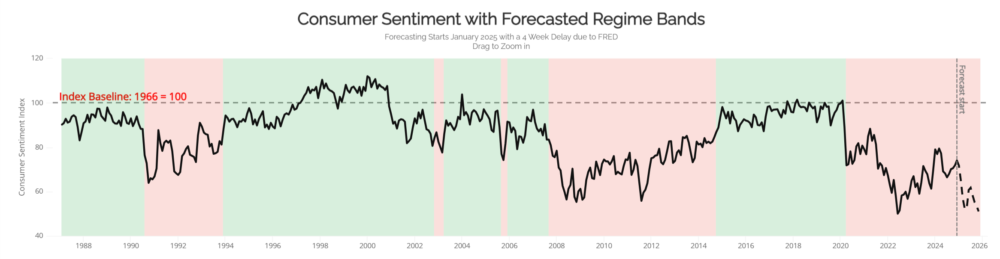
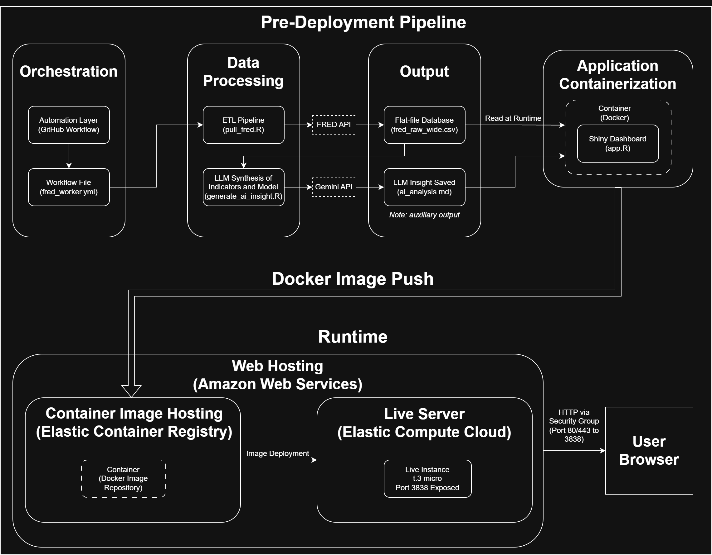
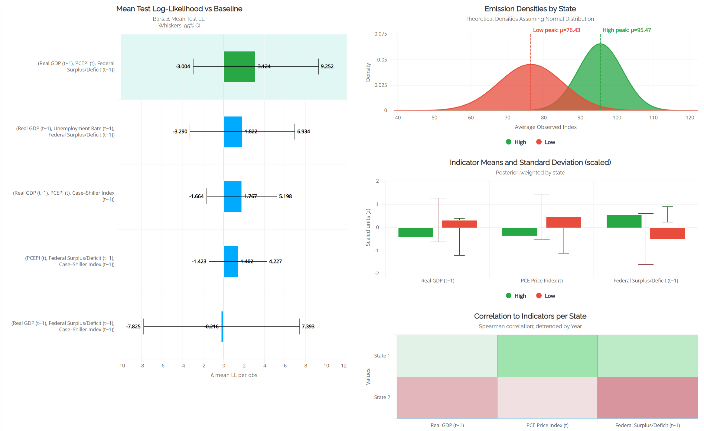
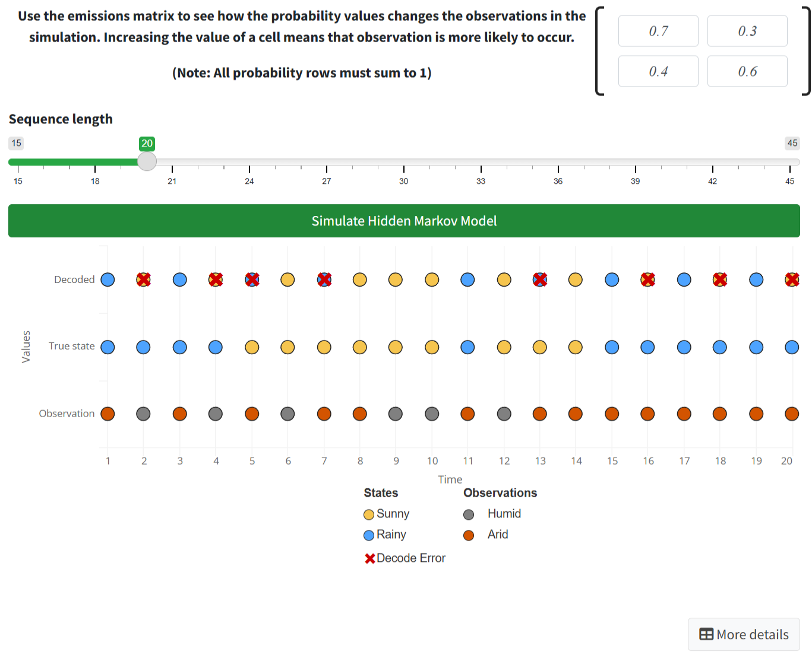

# Consumer Sentiment HMM: Live Economic Regime Dashboard


### [View Live Dashboard](http://3.209.5.209:3838/)

> **Note:** This application runs on a dedicated AWS EC2 instance. The forecasting pipeline updates monthly via automated GitHub Actions.

---

## Summary
This project applies a **Gaussian Hidden Markov Model (HMM)** to 37 years of US economic data to identify latent regimes in the University of Michigan's Consumer Sentiment Index. Unlike traditional time-series forecasting which assumes continuity, this model detects structural breaks in the economy, identifying distinct high and low sentiment environments.

The project is deployed as an **R/Shiny application**, containerized with **Docker**, and hosted on **AWS EC2**, featuring a fully automated ETL and AI inference pipeline.


*(Figure 1: The dashboard overview showing decoded regimes against historical economic events)*

---

## System Architecture

The system follows a **Three-Tier Architecture** for orchestration, processing, and presentation.

* **Orchestration (GitHub Actions):** A scheduled worker triggers monthly to activate the pipeline.
* **Processing (ETL and Inference):** R scripts fetch raw data (FRED API), update the HMM probabilities, and generate an auxiliary narrative synthesis using **Google Gemini 2.5 Flash**.
* **Presentation (R Shiny):** The results are displayed in a containerized R Shiny app and deployed to AWS EC2 for public access.


*(Figure 2: The end-to-end data pipeline from GitHub Orchestration to AWS Runtime)*

---

## The Model: Hidden Markov Methodology
The core model is a 2-State Gaussian HMM trained on 17 macroeconomic indicators (1987–2024).

### Feature Selection
Through rigorous rolling cross-validation and log-likelihood analysis, the model identified three key drivers of sentiment regimes:
* **Real GDP (12-mo lag):** Captures income and productivity momentum.
* **PCE Price Index:** Captures cost-of-living/inflationary pressure.
* **Federal Surplus/Deficit (12-mo lag):** Proxies the fiscal policy backdrop.


*(Figure 1: Summary of the best model's emissions values and statistics)*

### Regime Identification
The model successfully decodes two distinct states without supervision:
* **State 1 (High Sentiment):** Characterized by steady growth, low inflation, and stability.
* **State 2 (Low Sentiment):** Aligns with every major recession (Dot-com, GFC, COVID-19) and high-stress periods.


*(Figure 3: t-SNE projection of economic data showing clear separation between the two inferred regimes)*

---

## Automated Narrative Synthesis (LLM-Assisted)

To aid interpreting the quantitative metrics for better insight, the dashboard integrates a **Generative AI Analyst**.

* **Model:** Google Gemini 2.5 Flash.
* **Methodology:** The system feeds the LLM model metrics from the HMM regume and the current **Z-Scores* for every economic indicator relative to the *current regime's baseline*.
* **Synthesis:** These deviations are fed into the AI to analyze underlying trends in the data, where it developes a concise narrative explanation of the current economic state, displayed directly on the dashboard.

---

## Key Application Features

### Live Forecasting System
The Forecasting tab loads fresh data from the repo's automated worker.
* **Dynamic Z-Scoring:** Incoming data is normalized against training baselines in real-time.
* **Anomaly Detection:** Specific indicators that are behaving inconsistently with the current regime are flagged.

### Interactive HMM Simulation
To aid in understanding the underlying algorithm and logic of the HMM, an interactive demo is available for users to:
* Manually tune Transition and Emission matrices.
* Visualize the **Expectation-Maximization (EM)** algorithm step-by-step.
* Run live simulations to see how probability shifts affect state decoding.


*(Figure 4: A demo to demonstrate the Hidden Markov Model and transition/emission probabilities)*

## Design Tradeoffs
* Flat-file storage was chosen over a database to simplify deployment and ensure deterministic builds.
* EC2 was selected over managed PaaS to retain full control over runtime behavior and networking.
* LLM inference is performed offline to avoid latency, cost variability, and nondeterminism at runtime.


---

## Build Locally

Since the production image is hosted on a private AWS ECR registry, the application can be built locally from source:

```bash
# Clone repository
git clone [https://github.com/warispopal897/ConsumerSentimentHMM.git](https://github.com/warispopal897/ConsumerSentimentHMM.git)

# Build Docker Image
docker build -t csi_hmm_dashboard .

# Run Container
docker run -p 3838:3838 csi_hmm_dashboard
